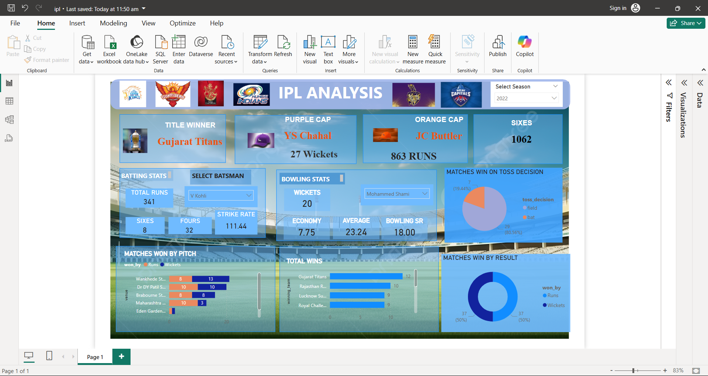

# 🏏 IPL Victory Predictor

A Machine Learning-based web application that predicts the **winning probability of IPL teams** based on real-time match conditions.

---

## 🚀 Features

- 📊 Predicts win probability for both teams
- ⚡ Real-time match input (score, overs, wickets, target)
- 🧠 ML model built using Scikit-learn
- 📍 Considers venue and team performance
- 🎯 Interactive UI using Streamlit

---

### 🔹 Prediction App

### 🔹 Power BI Dashboard

---

## 🛠️ Tech Stack

- **Language:** Python  
- **Libraries:** Pandas, NumPy, Scikit-learn  
- **Visualization:** Power BI  
- **Framework:** Streamlit  

---

## ⚙️ Installation & Setup

### 1️⃣ Clone the repository

git clone https://github.com/nishanthgoud019/project-ipl.git
cd project-ipl
---
## 👨‍💻 Author
Mukthala Nishanth  
📍 Hyderabad, India  
GitHub: https://github.com/nishanthgoud019

